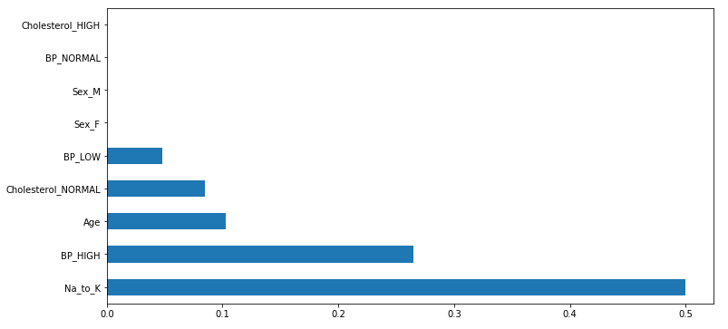
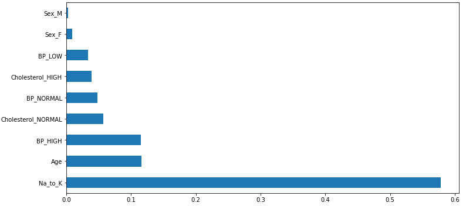

# Patients Drugs Classification
## Data Description

We have Drugs dataset. This dataset have each patient a data point (200 patients in total), and for each, we have 6 columns, each column represents a different information about the specific patient: demographic informmation (age, sex), health state (cholesterol, BP...) and the type of drug taken by this patient.

## Project Overview
In this project, will apply supervised learning techniques(multiclass claffisication), we will build a Patients Drugs Classifier.
The goal of the project is to understand the dataset, to get some insights from it, and finally to choose the best model that can predict the type of drug for a taget patient.
To accomplish this, we will:
* Understand, manipulate, process and explore the data.
* Try three different models:
 . **k nearest neighbors (KNN)** 
 
 . Decision Tree
 . Random Forest
* Get the optimized KNN, Decision Tree and Random Forest using GridsearchCV to reach the best model.
* Choose the best performer model. 
* Detect the features importance for each model.

## Project Steps
All the project steps are organized and listed below:
### 1. Data Import
### 2. Data Understanding and Manipulation
* Show data header
* Show columns names
* Data information
* Check to number of rows and columns
### 3. Data Processing
* Dealing with missing data
* Drop the duplicate rows
### 4. Data Exploration
* Data Description
* Target Variable (Drugs) and Insights
* Features and Insights
* Analyzing and Dealing with Outliers
### 5. Model Development
* Data Preparation
* Model1: KNN
* Model2: Decision Tree
* Model3: Random Forest
### 6. Model Optimization
* Model1: KNN
* Model2: Decision Tree
* Model3: Random Forest
### 7. Model Evaluation
* Model1: KNN
* Model2: Decision Tree
* Model3: Random Forest
### 8. Feature Importance
* Model1: Decision Tree 

* Model3: Random Forest 

## Conclusion
Three different learning classifiers (KNN, Decision Tree and Random Forest) were tested and evaluated using "Accuracy" and "Jaccard Similarity Score". Afterwards, we have achieved the best prediction performance.

Using all features in the dataset, Decision Tree and Random Forest are the best classifiers, the results are presented using the following metrics:
* Accuracy:  0.92307
* Jaccard_similarity_score:  0.92307
